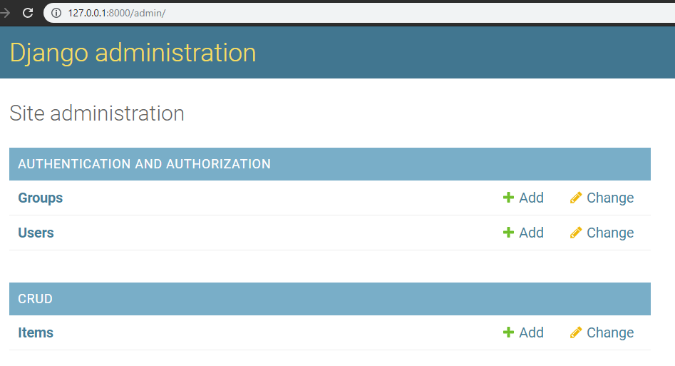
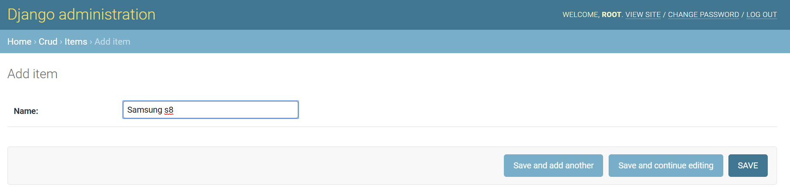
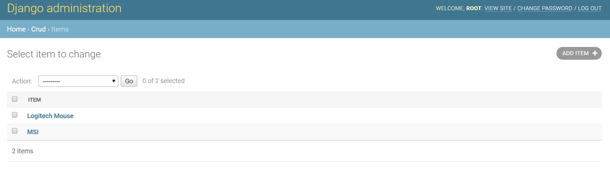
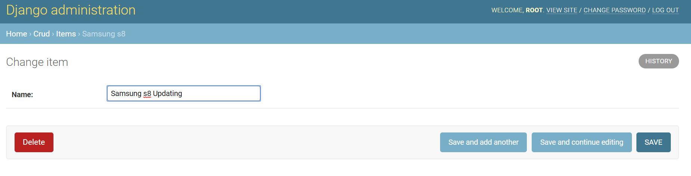
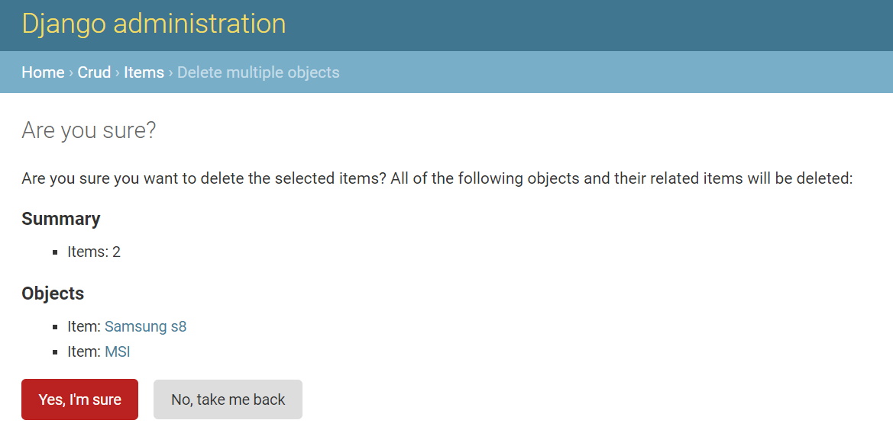
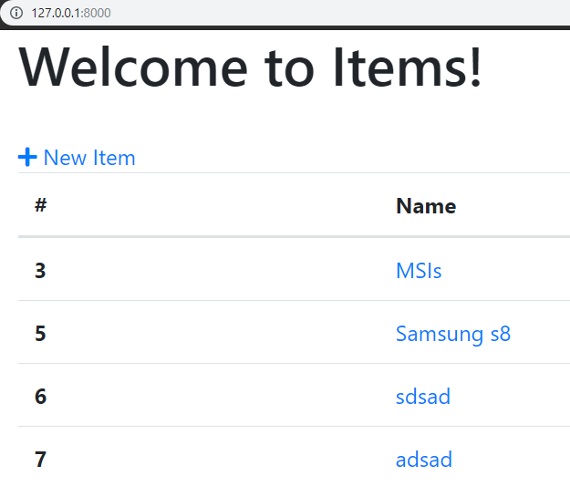
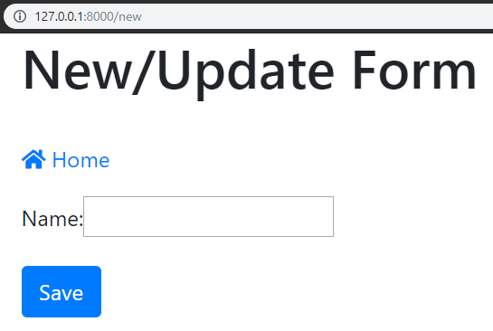
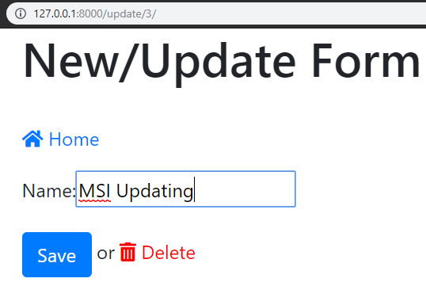
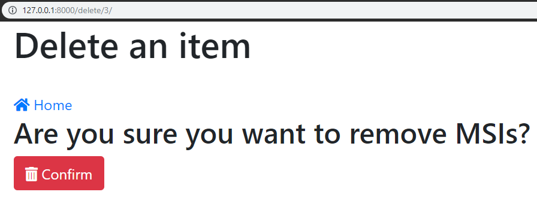

# Django Simple CRUD with SQLite  
### django v2.2.1 
### python v3.7.3 


# To check django and python version  
```
python -m django --version  
```
```
python  
```  

# Database credentials  
username: root  
password: root   

# Operations  

* Create item  
* Read item  
* Update item  
* Delete item  
  
# Bonus Operations  

* Admin Dashboard  

# Usage  
```
python manage.py runserver  
```

# Admin UI
## Admin Dashboard    

   

## Create item  

   

## Read item  

   

## Update item  

   

## Delete item  

   

# User UI
## Homepage  

   

## Create item  

   

## Read item  

   

## Update item  

   

## Delete item  

   


# Tutorial that Im following to achieve this project  
[Full CRUD with Django 2.0 in 30 minutes ( 2018 )](https://www.youtube.com/watch?v=Kf9KB_TZY5U&t=1238s)  
