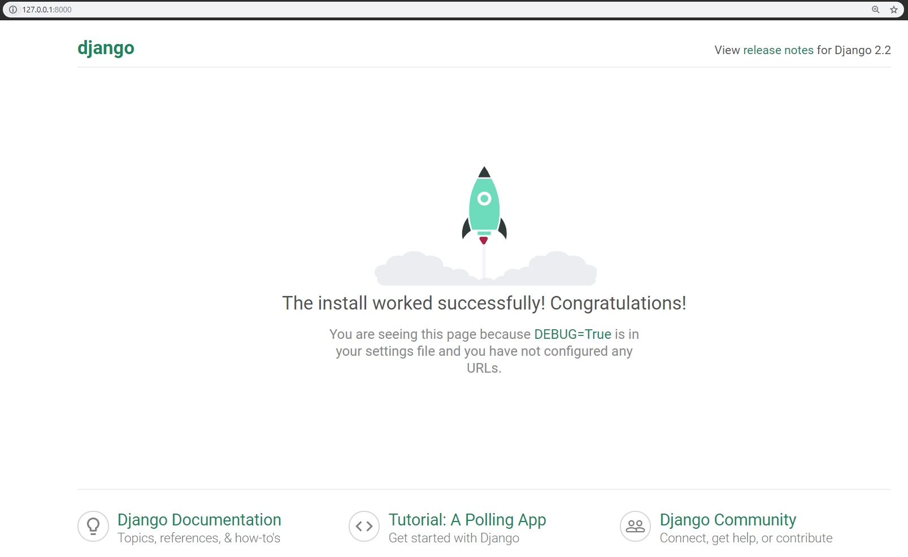
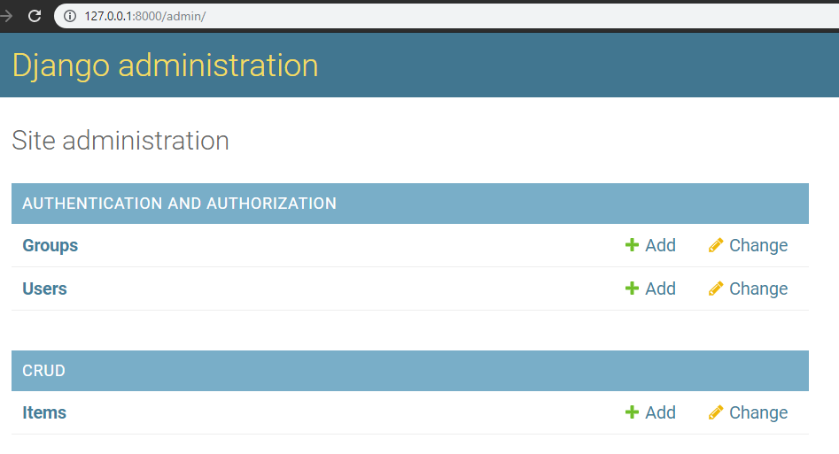
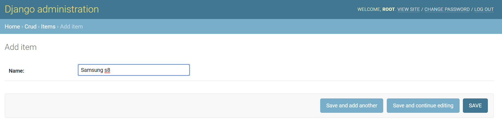
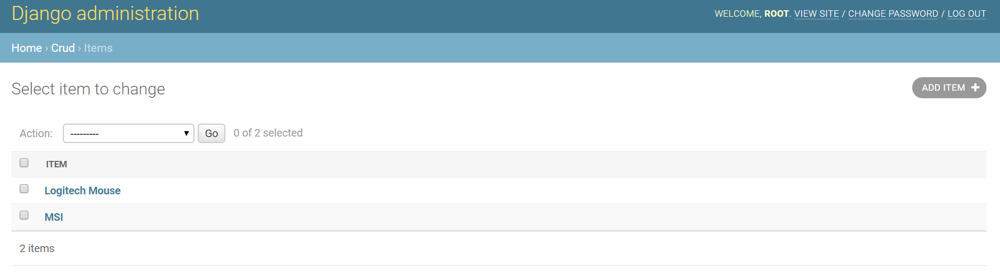
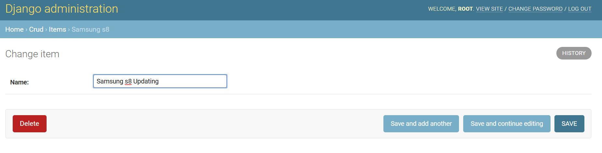

# Django Simple CRUD with SQLite  
### django v2.2.1 
### python v3.7.3 


# To check django and python version  
```
python -m django --version  
```
```
python  
```  

# Database credentials  
username: root  
password: root   

# Operations  

* Create item  
* Read item  
* Update item  
* Delete item  
  
# Usage  
```
python manage.py runserver  
```

# Postman
## Homepage  
   

## Homepage  
   

## Create  
   

## Read  
   

## Update  
   

## Delete  
   


Tutorial that Im following to achieve this project  
[Full CRUD with Django 2.0 in 30 minutes ( 2018 )](https://www.youtube.com/watch?v=Kf9KB_TZY5U&t=1238s)  
